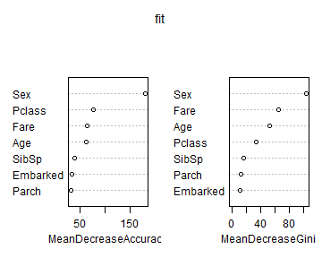
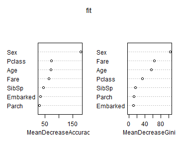

Titanic Kaggle
========================================================

Load both the train and test data
--------------------------------------


```r
rm(list = ls())
train <- read.csv(file = "../data/raw//train.csv", header = T, sep = ",")
test <- read.csv(file = "../data/raw//test.csv", header = T, sep = ",")
```


Initial Analysis
---------------------------

```r
summary(train)
```

```
##   PassengerId     Survived         Pclass    
##  Min.   :  1   Min.   :0.000   Min.   :1.00  
##  1st Qu.:224   1st Qu.:0.000   1st Qu.:2.00  
##  Median :446   Median :0.000   Median :3.00  
##  Mean   :446   Mean   :0.384   Mean   :2.31  
##  3rd Qu.:668   3rd Qu.:1.000   3rd Qu.:3.00  
##  Max.   :891   Max.   :1.000   Max.   :3.00  
##                                              
##                                     Name         Sex           Age       
##  Abbing, Mr. Anthony                  :  1   female:314   Min.   : 0.42  
##  Abbott, Mr. Rossmore Edward          :  1   male  :577   1st Qu.:20.12  
##  Abbott, Mrs. Stanton (Rosa Hunt)     :  1                Median :28.00  
##  Abelson, Mr. Samuel                  :  1                Mean   :29.70  
##  Abelson, Mrs. Samuel (Hannah Wizosky):  1                3rd Qu.:38.00  
##  Adahl, Mr. Mauritz Nils Martin       :  1                Max.   :80.00  
##  (Other)                              :885                NA's   :177    
##      SibSp           Parch            Ticket         Fare      
##  Min.   :0.000   Min.   :0.000   1601    :  7   Min.   :  0.0  
##  1st Qu.:0.000   1st Qu.:0.000   347082  :  7   1st Qu.:  7.9  
##  Median :0.000   Median :0.000   CA. 2343:  7   Median : 14.5  
##  Mean   :0.523   Mean   :0.382   3101295 :  6   Mean   : 32.2  
##  3rd Qu.:1.000   3rd Qu.:0.000   347088  :  6   3rd Qu.: 31.0  
##  Max.   :8.000   Max.   :6.000   CA 2144 :  6   Max.   :512.3  
##                                  (Other) :852                  
##          Cabin     Embarked
##             :687    :  2   
##  B96 B98    :  4   C:168   
##  C23 C25 C27:  4   Q: 77   
##  G6         :  4   S:644   
##  C22 C26    :  3           
##  D          :  3           
##  (Other)    :186
```

```r
summary(test)
```

```
##   PassengerId       Pclass    
##  Min.   : 892   Min.   :1.00  
##  1st Qu.: 996   1st Qu.:1.00  
##  Median :1100   Median :3.00  
##  Mean   :1100   Mean   :2.27  
##  3rd Qu.:1205   3rd Qu.:3.00  
##  Max.   :1309   Max.   :3.00  
##                               
##                                         Name         Sex     
##  Abbott, Master. Eugene Joseph            :  1   female:152  
##  Abelseth, Miss. Karen Marie              :  1   male  :266  
##  Abelseth, Mr. Olaus Jorgensen            :  1               
##  Abrahamsson, Mr. Abraham August Johannes :  1               
##  Abrahim, Mrs. Joseph (Sophie Halaut Easu):  1               
##  Aks, Master. Philip Frank                :  1               
##  (Other)                                  :412               
##       Age            SibSp           Parch            Ticket   
##  Min.   : 0.17   Min.   :0.000   Min.   :0.000   PC 17608:  5  
##  1st Qu.:21.00   1st Qu.:0.000   1st Qu.:0.000   113503  :  4  
##  Median :27.00   Median :0.000   Median :0.000   CA. 2343:  4  
##  Mean   :30.27   Mean   :0.447   Mean   :0.392   16966   :  3  
##  3rd Qu.:39.00   3rd Qu.:1.000   3rd Qu.:0.000   220845  :  3  
##  Max.   :76.00   Max.   :8.000   Max.   :9.000   347077  :  3  
##  NA's   :86                                      (Other) :396  
##       Fare                   Cabin     Embarked
##  Min.   :  0.0                  :327   C:102   
##  1st Qu.:  7.9   B57 B59 B63 B66:  3   Q: 46   
##  Median : 14.5   A34            :  2   S:270   
##  Mean   : 35.6   B45            :  2           
##  3rd Qu.: 31.5   C101           :  2           
##  Max.   :512.3   C116           :  2           
##  NA's   :1       (Other)        : 80
```

A few things worth noting based on the summary:

* The Survived variable should be a factor variable with two levels, but we can always use it as a factor using the "as.factor()" method.

* There are a few missing values in Age in both sets. We can fill them with different methods but whatever methods we use must only be based on the train data. The same works for the Fare variable.

* Embarked variable has two missing values in the train data. Since this is a very small portion, we can first fill them with the value "S" (the largest level).

* PClass should probably be a factor variable but there is possibly a ranking in the variable (first class, middle class, and third class). So in order to keep this info, we leave it as is (although this may not precisely represent the difference between two classes). We can think about ordinal encoding but the algorithms we are using in R may not accept ordinal variables.

* We should probably not include PassengerId, Ticket and Cabin in the modeling. But we can always check them later.

* Usually I would treat the Name variable the same as the three variables above. But according to the tutorial on Kaggle, the text in the Name may actually provide something useful. So We can keep it now.

Preprocessing
--------------------------
### Filling the missing values
There are a few different ways for filling missing values. We will start with the simplest one -- fill all missing value with the median value in the train data.


```r
train.processed <- train
test.processed <- test

# filling the missing value in the Age variable
train.processed$Age[is.na(train.processed$Age)] <- median(train.processed$Age, 
    na.rm = T)
test.processed$Age[is.na(test.processed$Age)] <- median(train.processed$Age, 
    na.rm = T)

# filling the missing value in the Fare variable in test data
test.processed$Fare[is.na(test.processed$Fare)] <- median(train.processed$Fare, 
    na.rm = T)

# fix the missing values in the Embarked variable this may be a bit tricky.
# In order to keep the same level order in the variable we have to merge the
# train and test data together first
test.processed$Survived <- NA
combined <- rbind(train.processed, test.processed)
combined$Embarked[combined$Embarked == ""] <- "S"
combined$Embarked <- factor(combined$Embarked)

# split back to train and test data
train.processed <- combined[1:891, ]
test.processed <- combined[-c(1:891), ]

save(train.processed, file = "../data/processed/train.processed.v1.RData")
save(test.processed, file = "../data/processed/test.processed.v1.RData")
```


After this simple preprocessing, let's take a look the summary.

```r
summary(train.processed)
```

```
##   PassengerId     Survived         Pclass    
##  Min.   :  1   Min.   :0.000   Min.   :1.00  
##  1st Qu.:224   1st Qu.:0.000   1st Qu.:2.00  
##  Median :446   Median :0.000   Median :3.00  
##  Mean   :446   Mean   :0.384   Mean   :2.31  
##  3rd Qu.:668   3rd Qu.:1.000   3rd Qu.:3.00  
##  Max.   :891   Max.   :1.000   Max.   :3.00  
##                                              
##                                     Name         Sex           Age       
##  Abbing, Mr. Anthony                  :  1   female:314   Min.   : 0.42  
##  Abbott, Mr. Rossmore Edward          :  1   male  :577   1st Qu.:22.00  
##  Abbott, Mrs. Stanton (Rosa Hunt)     :  1                Median :28.00  
##  Abelson, Mr. Samuel                  :  1                Mean   :29.36  
##  Abelson, Mrs. Samuel (Hannah Wizosky):  1                3rd Qu.:35.00  
##  Adahl, Mr. Mauritz Nils Martin       :  1                Max.   :80.00  
##  (Other)                              :885                               
##      SibSp           Parch            Ticket         Fare      
##  Min.   :0.000   Min.   :0.000   1601    :  7   Min.   :  0.0  
##  1st Qu.:0.000   1st Qu.:0.000   347082  :  7   1st Qu.:  7.9  
##  Median :0.000   Median :0.000   CA. 2343:  7   Median : 14.5  
##  Mean   :0.523   Mean   :0.382   3101295 :  6   Mean   : 32.2  
##  3rd Qu.:1.000   3rd Qu.:0.000   347088  :  6   3rd Qu.: 31.0  
##  Max.   :8.000   Max.   :6.000   CA 2144 :  6   Max.   :512.3  
##                                  (Other) :852                  
##          Cabin     Embarked
##             :687   C:168   
##  B96 B98    :  4   Q: 77   
##  C23 C25 C27:  4   S:646   
##  G6         :  4           
##  C22 C26    :  3           
##  D          :  3           
##  (Other)    :186
```

```r
summary(test.processed)
```

```
##   PassengerId      Survived       Pclass    
##  Min.   : 892   Min.   : NA   Min.   :1.00  
##  1st Qu.: 996   1st Qu.: NA   1st Qu.:1.00  
##  Median :1100   Median : NA   Median :3.00  
##  Mean   :1100   Mean   :NaN   Mean   :2.27  
##  3rd Qu.:1205   3rd Qu.: NA   3rd Qu.:3.00  
##  Max.   :1309   Max.   : NA   Max.   :3.00  
##                 NA's   :418                 
##                                        Name         Sex     
##  Connolly, Miss. Kate                    :  1   female:152  
##  Kelly, Mr. James                        :  1   male  :266  
##  Abbott, Master. Eugene Joseph           :  1               
##  Abelseth, Miss. Karen Marie             :  1               
##  Abelseth, Mr. Olaus Jorgensen           :  1               
##  Abrahamsson, Mr. Abraham August Johannes:  1               
##  (Other)                                 :412               
##       Age            SibSp           Parch            Ticket   
##  Min.   : 0.17   Min.   :0.000   Min.   :0.000   PC 17608:  5  
##  1st Qu.:23.00   1st Qu.:0.000   1st Qu.:0.000   113503  :  4  
##  Median :28.00   Median :0.000   Median :0.000   CA. 2343:  4  
##  Mean   :29.81   Mean   :0.447   Mean   :0.392   16966   :  3  
##  3rd Qu.:35.75   3rd Qu.:1.000   3rd Qu.:0.000   220845  :  3  
##  Max.   :76.00   Max.   :8.000   Max.   :9.000   347077  :  3  
##                                                  (Other) :396  
##       Fare                   Cabin     Embarked
##  Min.   :  0.0                  :327   C:102   
##  1st Qu.:  7.9   B57 B59 B63 B66:  3   Q: 46   
##  Median : 14.5   A34            :  2   S:270   
##  Mean   : 35.6   C101           :  2           
##  3rd Qu.: 31.5   C23 C25 C27    :  2           
##  Max.   :512.3   C78            :  2           
##                  (Other)        : 80
```

There are no more missing values except for the Survived variable in the test, which is the target we are going to predict.

Prediction
-----------------------------
### Random Forest
If you haven't install the randomForest package, install it first.

```r
# install.packages('randomForest')
require(randomForest)
```

```
## Loading required package: randomForest
```

```
## Warning: package 'randomForest' was built under R version 3.0.3
```

```
## randomForest 4.6-7
## Type rfNews() to see new features/changes/bug fixes.
```

```r
set.seed(101)

fit <- randomForest(as.factor(Survived) ~ . - PassengerId - Name - Ticket - 
    Cabin, data = train.processed, ntree = 2000, importance = T)
```

Let's take a look at the variable importance.

```r
varImpPlot(fit)
```

 

It seems that the variable Sex is dominating. This may not be good but let's see the prediction of this model first.

```r
test.processed$Survived <- NULL
Prediction <- predict(fit, test.processed)
submit <- data.frame(PassengerId = test.processed$PassengerId, Survived = Prediction)
write.csv(submit, file = "../results/res.randomforest.v1.csv", row.names = FALSE)
```

Now this submission on April 12th, 2014 achieved 77.512% accuracy, ranking 803rd/1264. Good job submitting the first result. We have a lot space for improvement. Keep going!

Analysis on April 13, 2014
--------------------------------
Yesterday we used the variable median to fill the missing values in the data. What if we use another way to do that instead?

We use the same method in the tutorial--the rpart with anova method.

```r
# we set the value of original empty cells in Age back to NA
train.processed$Age[is.na(train$Age)] <- NA
test.processed$Age[is.na(test$Age)] <- NA

# install.package('rpart')
require(rpart)
```

```
## Loading required package: rpart
```

```
## Warning: package 'rpart' was built under R version 3.0.3
```

```r
Agefit <- rpart(Age ~ Pclass + Sex + SibSp + Parch + Fare + Embarked, data = train.processed[!is.na(train.processed$Age), 
    ], method = "anova")

train.processed$Age[is.na(train.processed$Age)] <- predict(Agefit, train.processed[is.na(train.processed$Age), 
    ])
test.processed$Age[is.na(test.processed$Age)] <- predict(Agefit, test.processed[is.na(test.processed$Age), 
    ])

save(train.processed, file = "../data/processed/train.processed.v2.RData")
save(test.processed, file = "../data/processed/test.processed.v2.RData")
```

Prediction
-----------------------------
### Random Forest
If you haven't install the randomForest package, install it first.

```r
# install.packages('randomForest')
require(randomForest)
set.seed(101)

fit <- randomForest(as.factor(Survived) ~ . - PassengerId - Name - Ticket - 
    Cabin, data = train.processed, ntree = 2000, importance = T)
```

Let's take a look at the variable importance.

```r
varImpPlot(fit)
```

 

It seems that the variable Sex is dominating. This may not be good but let's see the prediction of this model first.

```r
test.processed$Survived <- NULL
Prediction <- predict(fit, test.processed)
submit <- data.frame(PassengerId = test.processed$PassengerId, Survived = Prediction)
write.csv(submit, file = "../results/res.randomforest.v2.csv", row.names = FALSE)
```

Now this submission on April 13th, 2014 achieved 77.990% accuracy, ranking 741st/1258. Good job submitting the first result. We have a lot space for improvement. Keep going!

Analysis on April 19, 2014
==============================================
(Mentioning about Learning Curve in Andrew Ng's class here) According to the learning curve analysis on Logistic Regression (this will be inserted here), we are likely to be underfitting the data. Therefore, getting more data is not going to help much. However, we can add additional features or polynomial terms to help. 

So what additional features can we add here? Remember that at the beginning, we removed several features including PassengerId, Cabin, Ticket and Name. As mentioned in the tutorial, the first three features are almost unique to each passenger. But what about the Name? Maybe we can extract something useful from those text strings. The tutorial mentioned the Titles of each passenger, which represents their social class and influences how they behaved. So let's extract the title as the tutorial does.


```r
test.processed$Survived <- NA
combi <- rbind(train.processed, test.processed)
combi$Name <- as.character(combi$Name)
combi$Title <- sapply(combi$Name, FUN = function(x) {
    strsplit(x, split = "[,.]")[[1]][2]
})
combi$Title <- sub(" ", "", combi$Title)
```

OK, let's take a look at it.

```r
table(combi$Title)
```

```
## 
##         Capt          Col          Don         Dona           Dr 
##            1            4            1            1            8 
##     Jonkheer         Lady        Major       Master         Miss 
##            1            1            2           61          260 
##         Mlle          Mme           Mr          Mrs           Ms 
##            2            1          757          197            2 
##          Rev          Sir the Countess 
##            8            1            1
```

It appears that there are some rare titles and we need to merge them together.

```r
combi$Title[combi$Title %in% c("Mme", "Mlle")] <- "Mlle"
combi$Title[combi$Title %in% c("Capt", "Don", "Major", "Sir")] <- "Sir"
combi$Title[combi$Title %in% c("Dona", "Lady", "the Countess", "Jonkheer")] <- "Lady"
combi$Title <- factor(combi$Title)
```

The tutorial also added other features including FamilySize and FamilyID. We add them here as well.

```r
combi$FamilySize <- combi$SibSp + combi$Parch + 1
combi$Surname <- sapply(combi$Name, FUN = function(x) {
    strsplit(x, split = "[,.]")[[1]][1]
})
combi$FamilyID <- paste(as.character(combi$FamilySize), combi$Surname, sep = "")
famIDs <- data.frame(table(combi$FamilyID))
famIDs <- famIDs[famIDs$Freq <= 2, ]
combi$FamilyID[combi$FamilyID %in% famIDs$Var1] <- "Small"
combi$FamilyID <- factor(combi$FamilyID)

combi$Survived <- as.factor(combi$Survived)
train.processed <- combi[1:891, ]
test.processed <- combi[892:1309, ]
save(train.processed, file = "../data/processed/train.processed.v3.RData")
save(test.processed, file = "../data/processed/test.processed.v3.RData")
```

Prediction
------------------------

```r
fit <- glm(Survived ~ Pclass + Sex + Age + SibSp + Parch + Fare + Embarked + 
    Title + FamilySize, family = binomial, data = train.processed)
```

```
## Warning: glm.fit: fitted probabilities numerically 0 or 1 occurred
```

```r

test.processed$Survived <- NULL
Prediction <- ifelse(predict(fit, newdata = test.processed, type = "response") > 
    0.5, "1", "0")
```

```
## Warning: prediction from a rank-deficient fit may be misleading
```

```r
submit <- data.frame(PassengerId = test.processed$PassengerId, Survived = Prediction)
write.csv(submit, file = "../results/res.randomforest.v3.csv", row.names = FALSE)
```

And this achieves the same score 0.77990 as the randomForest we tried before. And it is better than last time when we tried Logistic Regression (around 0.75). This means adding the new features does help!

Analysis on April 21, 2014
======================================
Adding additional features
--------------------------------------
We can consider adding polynomial terms in the model. But it only works with numerical variables. Start with degree 2 polynomials and move on to higher degree later. We can also consider the interaction between variables, for example, the one between Age and Sex (using Age*Sex in the model formula).


```r
fit <- glm(Survived ~ Pclass + Sex + Sex:Age + poly(Age, 2) + poly(SibSp, 2) + 
    poly(Parch, 2) + poly(Fare, 2) + Embarked + Title * Sex + I(FamilySize^2), 
    family = binomial, data = train.processed)
```

```
## Warning: glm.fit: algorithm did not converge
## Warning: glm.fit: fitted probabilities numerically 0 or 1 occurred
```

```r
summary(fit)
```

```
## 
## Call:
## glm(formula = Survived ~ Pclass + Sex + Sex:Age + poly(Age, 2) + 
##     poly(SibSp, 2) + poly(Parch, 2) + poly(Fare, 2) + Embarked + 
##     Title * Sex + I(FamilySize^2), family = binomial, data = train.processed)
## 
## Deviance Residuals: 
##    Min      1Q  Median      3Q     Max  
## -2.453  -0.559  -0.385   0.524   2.455  
## 
## Coefficients: (9 not defined because of singularities)
##                      Estimate Std. Error z value Pr(>|z|)    
## (Intercept)          9.44e+12   7.03e+13    0.13    0.893    
## Pclass              -1.13e+00   1.87e-01   -6.03  1.6e-09 ***
## Sexmale             -9.44e+12   7.03e+13   -0.13    0.893    
## poly(Age, 2)1       -1.14e+01   5.35e+00   -2.13    0.033 *  
## poly(Age, 2)2       -1.18e-01   3.78e+00   -0.03    0.975    
## poly(SibSp, 2)1     -5.41e+01   3.12e+01   -1.73    0.083 .  
## poly(SibSp, 2)2     -2.73e+01   1.50e+01   -1.82    0.068 .  
## poly(Parch, 2)1     -1.64e+01   1.37e+01   -1.20    0.232    
## poly(Parch, 2)2     -5.28e+00   4.94e+00   -1.07    0.285    
## poly(Fare, 2)1       3.40e+00   4.28e+00    0.80    0.426    
## poly(Fare, 2)2       2.01e+00   4.04e+00    0.50    0.619    
## EmbarkedQ            8.96e-02   4.07e-01    0.22    0.826    
## EmbarkedS           -3.58e-01   2.51e-01   -1.43    0.153    
## TitleDr             -9.44e+12   7.03e+13   -0.13    0.893    
## TitleLady           -9.44e+12   7.03e+13   -0.13    0.893    
## TitleMaster          2.70e+00   1.66e+00    1.63    0.104    
## TitleMiss           -9.44e+12   7.03e+13   -0.13    0.893    
## TitleMlle           -9.44e+12   7.03e+13   -0.13    0.893    
## TitleMr             -9.13e-01   1.46e+00   -0.62    0.532    
## TitleMrs            -9.44e+12   7.03e+13   -0.13    0.893    
## TitleMs             -9.44e+12   7.03e+13   -0.13    0.893    
## TitleRev            -2.54e+01   1.24e+05    0.00    1.000    
## TitleSir            -4.95e-01   1.71e+00   -0.29    0.772    
## I(FamilySize^2)      6.11e-02   8.72e-02    0.70    0.484    
## Sexfemale:Age        5.49e-03   2.02e-02    0.27    0.786    
## Sexmale:Age                NA         NA      NA       NA    
## Sexmale:TitleDr      9.44e+12   7.03e+13    0.13    0.893    
## Sexmale:TitleLady    9.44e+12   7.03e+13    0.13    0.893    
## Sexmale:TitleMaster        NA         NA      NA       NA    
## Sexmale:TitleMiss          NA         NA      NA       NA    
## Sexmale:TitleMlle          NA         NA      NA       NA    
## Sexmale:TitleMr            NA         NA      NA       NA    
## Sexmale:TitleMrs           NA         NA      NA       NA    
## Sexmale:TitleMs            NA         NA      NA       NA    
## Sexmale:TitleRev           NA         NA      NA       NA    
## Sexmale:TitleSir           NA         NA      NA       NA    
## ---
## Signif. codes:  0 '***' 0.001 '**' 0.01 '*' 0.05 '.' 0.1 ' ' 1
## 
## (Dispersion parameter for binomial family taken to be 1)
## 
##     Null deviance: 1186.66  on 890  degrees of freedom
## Residual deviance:  714.38  on 864  degrees of freedom
## AIC: 768.4
## 
## Number of Fisher Scoring iterations: 25
```

```r
test.processed$Survived <- NULL
Prediction <- ifelse(predict(fit, newdata = test.processed, type = "response") > 
    0.5, "1", "0")
```

```
## Warning: prediction from a rank-deficient fit may be misleading
```

```r
submit <- data.frame(PassengerId = test.processed$PassengerId, Survived = Prediction)
write.csv(submit, file = "../results/res.randomforest.v4.csv", row.names = FALSE)
# require(bestglm)
```

This improved the result with 0.00478 and now we rank at 516/1227. Next step, check if we are overfitting or still underfitting. Either way, consider feature selection to filter out irrelevant or redundant features. 

```r
require(e1071)
```

```
## Loading required package: e1071
```

```
## Warning: package 'e1071' was built under R version 3.0.3
```

```r
svmfit = svm(Survived ~ Pclass + Sex + Age + SibSp + Parch + Fare + Embarked + 
    Title + FamilySize, data = train.processed, kernel = "linear", cost = 10, 
    scale = FALSE)
test.processed$Survived <- NULL
Prediction <- predict(svmfit, newdata = test.processed)
submit <- data.frame(PassengerId = test.processed$PassengerId, Survived = Prediction)
write.csv(submit, file = "../results/res.randomforest.v5.csv", row.names = FALSE)
```

